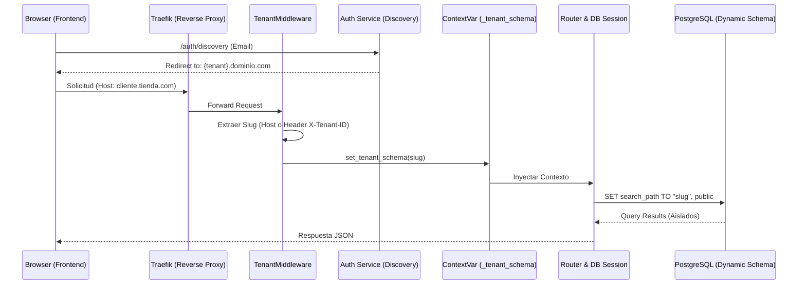

# 01 - Arquitectura del Sistema (Deep-Dive Técnico)

Este documento describe la infraestructura de nivel empresarial del proyecto **Mi Inventario Fácil**, detallando el ciclo de vida de la petición, la seguridad perimetral y la gestión de identidad en un entorno multi-rubro.

## 1. Stack Tecnológico de Alto Nivel
*   **Frontend**: React 18 (Vite) + Tailwind CSS. Gestión de estado mediante **Context API** (Caja-Context, Auth-Context).
*   **Backend**: FastAPI (Python 3.12). Arquitectura de routers modulares y dependencias asíncronas.
*   **Base de Datos**: **PostgreSQL 15+** (exclusivo, sin soporte SQLite). Pool de 80+50 conexiones con pre-ping.
*   **Identidad**: JWT (JSON Web Tokens) con soporte para **Impersonation** (suplantación de identidad para soporte técnico).
*   **Puente de Hardware**: Túnel dúplex mediante **WebSockets** (FastAPI <-> C# Bridge).
*   **SaaS Admin**: Panel de administración en React (Vite) para gestión centralizada de tenants.
*   **Módulos Activos**: Ferretería, Restaurante (5 fases), Barbería, Servicio Técnico, Lavandería.
*   **Sistema Multicaja**: Múltiples cajas registradoras físicas simultáneas con aislamiento por índice único parcial en PostgreSQL. Trazabilidad completa cajero→caja en ventas, créditos y cotizaciones.

## 2. Ciclo de Vida de una Petición e Identidad SaaS

El sistema utiliza un middleware de detección de identidad que garantiza el aislamiento absoluto entre clientes.

## 3. Seguridad y Gestión de Sesiones

### A. Discovery Service (Mecanismo de Subdominio)
Para evitar que los usuarios tengan que recordar su subdominio, el endpoint `/auth/discovery` permite ingresar un correo electrónico. El sistema busca el `tenant_id` asociado en el esquema `public` y devuelve la URL de redirección correcta.

### B. Intercambio de Tokens (Impersonation Flow)
El sistema permite que un Super Administrador de la plataforma SaaS "entre" en la cuenta de un cliente para soporte sin pedir contraseñas:
1.  El Admin genera un token de intercambio.
2.  El endpoint `/auth/exchange-token` valida el token y emite una **Cookie HttpOnly** con el claim `impersonated: True`.
3.  Todas las acciones realizadas bajo este flujo quedan auditadas como "Suplantación de Identidad".

## 4. Middleware Detallado: `TenantMiddleware`

La lógica de selección de empresa sigue una jerarquía de prioridades:
1.  **Header `x-tenant-id`**: Prioridad absoluta. Utilizado por servicios internos y el Bridge de hardware.
2.  **Subdominio**: Análisis del Host (ej: `demo.miinventariofacil.com` -> `demo`). Bloquea subdominios reservados (`www`, `api`, `admin`).
3.  **Localhost Development**: Soporta subdominios en localhost (`cliente1.localhost`) para desarrollo multi-tenant local.

## 5. Comunicación en Tiempo Real (WebSocket Architecture)

El `ConnectionManager` utiliza un almacenamiento anidado: `{ tenant_id: { client_id: WebSocket } }`.
*   **Seguridad**: Al enviar un comando (ej. "Imprimir Ticket"), el servicio busca primero el `tenant_id` del usuario actual en el mapa de conexiones, asegurando que el comando solo llegue al hardware físico de su propia tienda.

## 6. Arquitectura Híbrida y Offline (Sync Logic)
El sistema está diseñado para operar en entornos con internet inestable:
*   **Ventas Offline**: El frontend puede generar ventas con un `unique_uuid` (UUID v4).
*   **Sincronización**: Al recuperar conexión, el sistema envía los paquetes UUID al backend. El backend usa `Sale.unique_uuid` como llave de idempotencia para evitar duplicados si la petición se reintentó múltiples veces.
